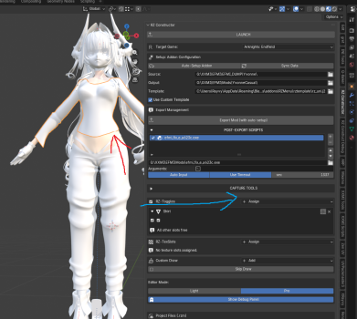
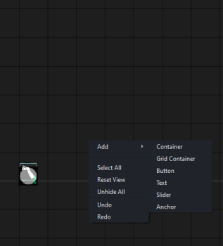
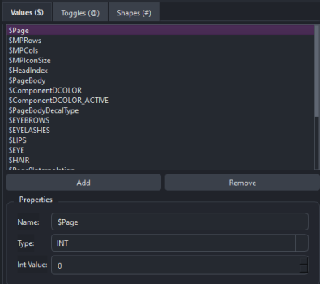
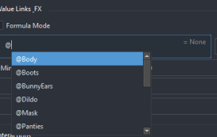

# 🌌 RZMenu: Ультимативный Гайд (Черновик)
### Как перестать писать .ini руками и начать жить (или страдать, но красиво)

**RZMenu** — это не просто "рисовалка" для кнопок. Это IDE, которая компилирует твой визуальный проект в мощные, оптимизированные и полностью автономные моды для 3DMigoto.

---

## 1. Подготовка и База
### Обязательные требования:
*   **PySide6:** Без него графический редактор не откроется.
Наличие XXMI-Tools/EFMI-Tools. Мой инструмент лишь "апгрейдит" мод. Но не создаёт его.

---

## 2. Первый запуск и Интерфейс
1.  Установи паки.
2.  Укажи пути в N-панели.
3.  Нажми **"LAUNCH"**.

### Основные окна:
*   **Outliner:** Иерархия твоих элементов. Поддерживает Drag-and-Drop (перетащил дочерку на родителя — и готово).
*   **Inspector:** Твой пульт управления. Размеры, цвета, ссылки на переменные и формулы.
*   **Asset Browser:** Твоё хранилище картинок. Засовывай PNG, DDS, GIF, SVG, MP4, WEBM — система сама разберется.
*   **Variables Panel:** Самое важное место. Реестр твоих переменных.

---

## 3. Анатомия элементов
Инструмент разделяет обязанности. Не заставляй фермера копать шахту.

*   **Anchor (Якорь):** Корень твоего меню. **Только он поддерживает перетаскивание курсором (Drag-and-Drop) в игре.** Хочешь двигать окно — начни с Anchor.
*   **Container:** "Голый" элемент. Нет сложной логики, нет инпутов. Идеально подходит для фона, декора или чего то другого чему будет вредно наличие инпут систем.
*   **Button/Slider:** Активные элементы. Поддерживают клики, наведения и изменение переменных.
*   **TEXT:** Специальный движок для шрифтов. Не поддерживает картинки — это ограничение шейдера. Хочешь текст на кнопке? Клади TEXT поверх Button.

*(ПКМ по вьюпорту или Shift+A для добавления)*

---

## 4. Система переменных (Registry)
Ты не можешь просто выдумать имя переменной в Инспекторе. Она **обязана** быть зарегистрирована в **Variables Panel**. Иначе — ошибка при экспорте.

### Переменные-символы:
*   `$` — Стандартная переменная (позиция, альфа, логика).
*   `@` — Тогглы (битмаски, переключатели состояний).
*   `#` — Шейпы (связь с шейпкеями в Blender).
*   `~` — Системные макросы.
    *   `~PV` (Parent Value) — магия наследования. Дочерний элемент сам поймет, какую переменную дергает его родитель.

---

## 5. Формулы и Логика (Hardcore Mode)
RZMenu дает тебе полный контроль через формулы.

### Пример анимации наведения (Hover):
Хочешь, чтобы кнопка увеличивалась при наведении? В поле размера пиши:
`$sizeX = $SizeX * (1 + w23 / 2)`
Где `w23` — это "вес" наведения. Когда курсор над элементом, он равен 1, когда нет — 0.

### Условная видимость (Conditional Visibility):
По умолчанию стоит `Always`. Хочешь, чтобы меню закрывалось? Ставь `Conditional` и пиши условие (например, если `$MenuOpen == 1`).

---

## 6. Работа с Шейпкеями (#)
1.  Создай переменную типа `#Shape` (или любую другую, если ты профи).
2.  В Blender N-панели подключи эту переменную в конфигурацию шейпкеев.
3.  В GUI привяжи к этой переменной Слайдер или Кнопку.
4.  Готово! Твой UI теперь управляет лицом или одеждой персонажа напрямую.

---

## 7. Экспорт и Финал
Нажал **"EXPORT"** — получил папку с модом.
**ВНИМАНИЕ:** Папки `modules` и `resources` — это НЕ мусор. Это ядро отрисовки и твои ассеты. Удалишь их — мод превратится в тыкву.

### Чего RZMenu НЕ УМЕЕТ (и не будет):
*   **Звуки:** 3DMigoto не про звук.
*   **Смена персонажей (Gameplay logic):** Это инструмент для GPU-инъекций, а не для взлома движка игры.
*   **Bloom/FOV:** Это тебе в ReShade.

---

## 8. Советы "Бати"
*   **Бэкапы:** Вся инфа в `.blend` файле, но сохраняй `.rzm` раз в час, если не хочешь плакать после краша.
*   **Is Page:** Если у тебя в GUI больше 50 элементов — используй "Is Page" для изоляции зон. Твои нервы скажут спасибо.

---
**RZMenu 4.0 (Public Beta)** — Используй на свой страх и риск. Бэкапься. Моддь. Побеждай.
