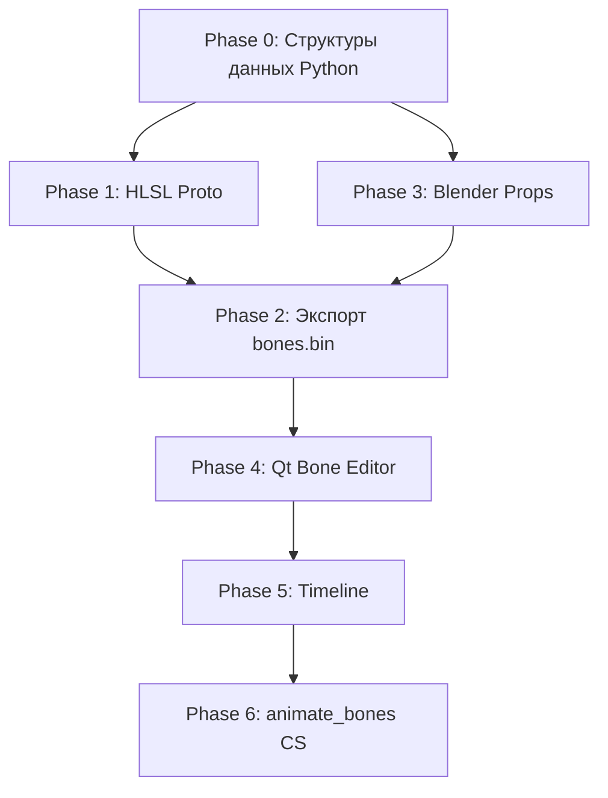

# Live2D-Style 2D Bone Animation System для RZMenu

## Анализ `draw_instancer.hlsl`

Шейдер — это **UI Compositor v3.3**, который рендерит UI-элементы через инстансинг квадриков. Ключевые факты:

| Область | Описание |
|---|---|
| **DataBuffer** `t100` | Массив `float4[7+]` на элемент: header, pos/size, color, tileData, mirrorData, clipRect, params |
| **IndexBuffer** `t104` | Индексы в DataBuffer для каждого инстанса |
| **ResourceStyleBuffer** `t105` | Стили (тень, свечение, outline, animations). 12× `float4` на стиль |
| **`SLOT_LIVE2D = 9`** | Зарезервированный слот — явный намёк, что Live2D планировался с самого начала |
| **`BIT_LIVE2D (1u << 2)`** | И флаг тоже уже зарезервирован в `header.x` |
| **`ApplyAnimation()`** | VS-функция: применяет hover-тилт, вращение. Именно сюда воткнётся skinning |
| **`mirrorData.w`** | Уже используется для rotation (в оборотах, 0–1). Слоты в DataBuffer ещё есть |
| **Expand EXPAND_PX=30** | Элементы расширяются на 30px для shadow-эффектов — важно учесть при костях |

**Вывод:** шейдер уже содержит заглушки именно для Live2D. Нужно только реализовать то, что зарезервировано.

---

## Концепция системы: как это работает в голове

### Принцип Live2D (упрощённо)
В Live2D **не вершины деформируются сами** — деформируются **UV-координаты** спрайта через решётку (mesh warp). Кости двигают контрольные точки решётки, а пиксели следуют за UV-деформацией.

Для **RZMenu** мы работаем с **прямоугольниками**, не произвольными мешами. Поэтому адаптируем подход:

> **Каждый элемент** = прямоугольный спрайт с 4 угловыми вершинами.  
> **Кость** = трансформация (позиция + угол + масштаб) в иерархии скелета.  
> **Скиннинг** = элемент привязан к кости с весом → вершины trансформируются матрицей кости.

### Архитектура данных в шейдере

```
BoneBuffer : register(t106)   // Массив float4x4 матриц костей (или 3×float4 = 12 float)
SkinBuffer : register(t107)   // Для каждого элемента: [bone_id_0, weight_0, bone_id_1, weight_1]
```

Для простого 2D достаточно **2 кости на элемент** (blend-кости для soft attachments).  
Матрица кости в 2D: 3×3 (или аффинная 2×3): scale + rotation + translation.

### Как кость трансформирует прямоугольник

```hlsl
// В ApplyAnimation() добавляем:
if (flags & BIT_LIVE2D) {
    float4 skin = SkinBuffer[instanceID]; // [b0, w0, b1, w1]
    int boneA = (int)skin.x;
    float wA  = skin.y;
    int boneB = (int)skin.z;
    float wB  = skin.w;

    // Берём матрицу кости (3 float4 = pos.xy, cos/sin, scale)
    float3x3 matA = LoadBoneMatrix(boneA);
    float3x3 matB = LoadBoneMatrix(boneB);

    // Применяем skinning к вершинам квадрика
    float2 worldPos = mul(matA, float3(localPos, 1)).xy * wA
                    + mul(matB, float3(localPos, 1)).xy * wB;
    return worldPos;
}
```

---

## Полный план реализации

### Фаза 0: Структуры данных (Python → Binary → HLSL)

#### 0.1 Формат BoneBuffer
Каждая кость = 3× `float4` = 12 float:  
```
[0] = (pos_x, pos_y, rot_cos, rot_sin)
[1] = (scale_x, scale_y, parent_bone_id, flags)
[2] = (pivot_x, pivot_y, 0, 0)        // пивот в локальных координатах
```
Total: `MAX_BONES × 3 × 16 bytes`.

#### 0.2 Формат SkinBuffer
Каждый инстанс = `float4` = 4 float:  
```
(bone_id_0, weight_0, bone_id_1, weight_1)
```
Поддержка до 2 костей на элемент (достаточно для 95% UI-анимаций).

#### 0.3 Изменения в DataBuffer
Используем уже зарезервированный флаг `BIT_LIVE2D` в `header.x`.

---

### Фаза 1: HLSL — Шейдер

#### [MODIFY] `draw_instancer.hlsl`
- Добавить `Buffer<float4> BoneBuffer : register(t106)` и `Buffer<float4> SkinBuffer : register(t107)`
- Добавить `LoadBoneMatrix(int idx)` — читает 3×float4 → affine 2D matrix
- Расширить `ApplyAnimation()`: при `BIT_LIVE2D` применить skinning к `expandedPos`+`expandedSize`
- UV-координаты: при skinning деформируем только позицию вершины, UV остаётся как есть (привязан к текстуре)

#### [NEW] `bone_skinning.hlsli`
Выделенный include-файл с утилитами скиннинга:
```hlsl
float2x3 LoadBoneMatrix(int boneIdx);
float2   ApplySkinning(float2 localPos, float4 skinData);
float2x3 BlendMatrices(float2x3 a, float2x3 b, float t);
```

---

### Фаза 2: Экспорт данных (Python)

#### [MODIFY] `operators/quick_export_ops.py`
Добавить экспорт `bones.bin` и `skin.bin` рядом с `data.bin`.

#### [NEW] `core/bone_system.py`
```python
class RZBone:
    id: int
    name: str
    parent_id: int      # -1 для корня
    local_pos: (x, y)
    local_rot: float    # радианы
    local_scale: (x, y)
    pivot: (x, y)

class RZSkeleton:
    bones: list[RZBone]
    
    def compute_world_matrices(self) -> list[Matrix2x3]:
        # Рекурсивно перемножает цепочку parent → child
        ...
    
    def to_binary(self) -> bytes:
        # float4 × 3 × len(bones)
        ...
```

#### [NEW] `core/skin_data.py`
```python
class RZSkinBinding:
    element_uid: str
    bone_id_0: int
    weight_0: float
    bone_id_1: int = -1
    weight_1: float = 0.0
```

---

### Фаза 3: Blender Properties

#### [MODIFY] `__init__.py` / `core/` — регистрация PropertyGroup

```python
class RZBoneProp(bpy.types.PropertyGroup):
    name: StringProperty()
    parent_name: StringProperty()
    pos_x: FloatProperty()
    pos_y: FloatProperty()
    rotation: FloatProperty()  # радианы
    scale_x: FloatProperty(default=1.0)
    scale_y: FloatProperty(default=1.0)
    pivot_x: FloatProperty()
    pivot_y: FloatProperty()

class RZSkeletonProp(bpy.types.PropertyGroup):
    bones: CollectionProperty(type=RZBoneProp)

class RZSkinSlotProp(bpy.types.PropertyGroup):
    element_uid: StringProperty()
    bone_name_0: StringProperty()
    weight_0: FloatProperty(default=1.0)
    bone_name_1: StringProperty()
    weight_1: FloatProperty(default=0.0)
```

---

### Фаза 4: Qt Editor — Скелетный редактор

Это самая важная часть — удобство создания анимаций.

#### 4.1 Новая панель: `BoneEditorPanel`

```
┌─ Skeleton Editor ──────────────────────────────────┐
│ [+ Add Bone] [🗑 Delete] [🔗 Set Parent]           │
│                                                     │
│ Bone Tree:                                          │
│  ▼ root_bone                                        │
│    ▼ spine                                          │
│      ▶ left_arm                                     │
│      ▶ right_arm                                    │
│                                                     │
│ Selected Bone: spine                                │
│  Pos X: [100] Y: [200]                              │
│  Rotation: [45°]                                    │
│  Scale X: [1.0] Y: [1.0]                            │
└─────────────────────────────────────────────────────┘
```

#### 4.2 Viewport: отображение костей и привязок

В `viewport.py` / `RZViewportScene`:
- **Кости** рисуются как стрелки поверх элементов (специальные `QGraphicsItem`)
- **Пивот** — кружок на кости, перетаскивается мышью
- **Выделение кости** → подсвечиваются привязанные элементы
- **Ctrl+Drag на элемент** → диалог привязки к выбранной кости с ползунком веса

#### 4.3 Bone Item в сцене

```python
class RZBoneItem(QGraphicsLineItem):
    def __init__(self, bone_id, name):
        ...
    
    def paint(self, painter, option, widget):
        # Рисуем как стрелку/ромбик (Live2D-стиль)
        ...
    
    def mouseMoveEvent(self, event):
        # Двигаем кость → обновляем все привязанные элементы
        ...
```

#### 4.4 Skin Weight Panel (в Inspector)

При выборе элемента в инспекторе добавляется секция:
```
┌─ Bone Skinning ────────────────────────────────────┐
│ Bone 0: [spine ▼]  Weight: [0.8 ═══════════░]      │
│ Bone 1: [left_arm ▼] Weight: [0.2 ═══░]            │
│                                                     │
│ [Auto-bind: nearest bone] [Clear bindings]          │
└─────────────────────────────────────────────────────┘
```

---

### Фаза 5: Система анимации (Timeline/Keyframes)

#### 5.1 Структура данных анимации

```python
class RZBoneKeyframe:
    time: float        # 0.0 → 1.0 (нормализованное время)
    pos: (x, y)
    rot: float
    scale: (x, y)
    easing: str        # 'LINEAR', 'EASE_IN', 'EASE_OUT', 'BEZIER'

class RZBoneAnimation:
    bone_name: str
    keyframes: list[RZBoneKeyframe]

class RZAnimation:
    name: str
    duration: float    # секунды
    loop: bool
    tracks: list[RZBoneAnimation]
```

#### 5.2 Timeline Widget

```
┌─ Animation Timeline ───────────────────────────────┐
│ [▶ Play] [⏹ Stop] [⏺ Record]  Duration: [2.0s]   │
│ Current: [0.45s] ════════════════════              │
│                                               ░░░░ │
│ spine    ◆────────◆────────◆                       │
│ left_arm    ◆──────────◆                           │
│ right_arm      ◆──────◆                            │
│                                                     │
│ ◆ = ключевой кадр (кликабельный/перетаскиваемый)   │
└─────────────────────────────────────────────────────┘
```

#### 5.3 Экспорт анимации

Анимации экспортируются как `animations.bin` или встраиваются в `.ini`-конфиг:

```ini
; Анимация "idle" для скелета "character_01"
[anim.idle.spine]
keyframes=0.0:pos(0,0):rot(0):ease(SINE) | 0.5:pos(0,5):rot(2):ease(SINE) | 1.0:pos(0,0):rot(0):ease(SINE)
```

Или в бинарном формате через отдельный буфер анимации.

---

### Фаза 6: Runtime в шейдере — вычисление поз

В игре (или в самом движке) нужен **CS (Compute Shader)**, который перед рендером:
1. Читает текущее время анимации из `IniParams`
2. Для каждой кости интерполирует keyframe → матрицу
3. Записывает матрицы в `BoneBuffer`

`draw_instancer.hlsl` только читает уже готовые матрицы — это правильное разделение ответственности.

#### [NEW] `animate_bones.hlsl` (Compute Shader)
```hlsl
// Аналог position_shape_anim2.hlsl, но для костей
[numthreads(64, 1, 1)]
void main(uint3 tid : SV_DispatchThreadID) {
    uint boneIdx = tid.x;
    float t = frac(IniParams[88].x * animSpeed); // фаза анимации
    
    // Интерполируем keyframes (линейно или bezier)
    float2 pos   = SampleTrack(PosTrackBuffer, boneIdx, t);
    float  rot   = SampleTrack(RotTrackBuffer, boneIdx, t);
    float2 scale = SampleTrack(ScaleTrackBuffer, boneIdx, t);
    
    // Вычисляем world matrix с учётом parent
    int parentIdx = (int)BoneHierarchy[boneIdx].z;
    float2x3 parentMat = (parentIdx >= 0) ? BoneWorldMatrices[parentIdx] : Identity2x3();
    float2x3 localMat  = MakeAffine2D(pos, rot, scale);
    BoneWorldMatrices[boneIdx] = Mul2x3(parentMat, localMat);
}
```

---

## Порядок реализации (рекомендуемый)



> [!IMPORTANT]
> Минимальный рабочий proof-of-concept требует только Faz 0 + 1 + 2: написать данные костей руками в Python, экспортировать, увидеть что элементы двигаются в шейдере.

> [!TIP]
> Начни с **одной статичной кости** без анимации — просто offset/rotation элемента через BoneBuffer. Это даст немедленный визуальный фидбек и позволит отладить pipeline данных.

---

## Открытые вопросы

1. **Количество костей**: MAX_BONES = 64? 128? Влияет на размер BoneBuffer.
2. **Привязка к регистрам**: `t106`, `t107` свободны? Нужно проверить все `.j2`-шаблоны.
3. **Анимация**: хранить keyframes в бинарном буфере или в `.ini`? Бинарь быстрее, но `.ini` легче редактировать.
4. **Skinning**: 2 кости на элемент достаточно? Или нужно 4 (как в стандартном 3D skinning)? Для UI-анимаций обычно достаточно 1–2.
5. **Qt Preview**: анимация должна воспроизводиться прямо в Qt Editor или только в игре?
