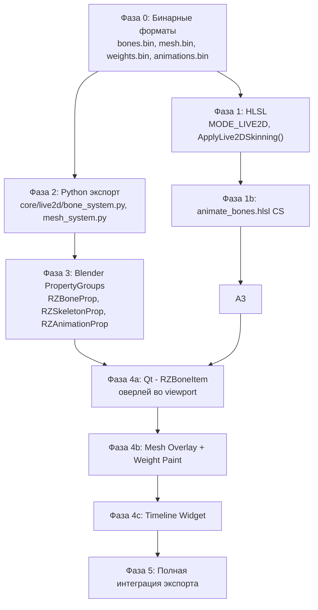

# Live2D-Style 2D Bone Animation System для RZMenu (rev 2)

## Анализ `draw_instancer.hlsl` + ключевое открытие про вертексы

Шейдер — это **UI Compositor v3.3**, который рендерит UI-элементы через инстансинг квадриков. Ключевые факты:

| Область | Описание |
|---|---|
| **DataBuffer** `t100` | Массив `float4[7+]` на элемент: header, pos/size, color, tileData, mirrorData, clipRect, params |
| **IndexBuffer** `t104` | Индексы в DataBuffer для каждого инстанса |
| **ResourceStyleBuffer** `t105` | Стили (тень, свечение, outline, animations). 12× `float4` на стиль |
| **`SLOT_LIVE2D = 9`** | Зарезервированный слот — явный намёк, что Live2D планировался с самого начала |
| **`BIT_LIVE2D (1u << 2)`** | И флаг тоже уже зарезервирован в `header.x` |
| **`ApplyAnimation()`** | VS-функция: применяет hover-тилт, вращение. Именно сюда воткнётся skinning |
| **`mirrorData.w`** | Уже используется для rotation (в оборотах, 0–1). Слоты в DataBuffer ещё есть |
| **Expand EXPAND_PX=30** | Элементы расширяются на 30px для shadow-эффектов — важно учесть при костях |
| **vID % 6 = quad** | Обычный элемент = 6 вертексов (1 квадрик). Текст = до 32 символов × 6 = 192 вертексов. **Это и есть механизм для Live2D-меша** |

### 🔑 Ключевое открытие: Multi-Vertex Draw

В шейдере уже есть паттерн множественных квадриков на инстанс — он используется для текста:
```hlsl
// Строки 285-286 draw_instancer.hlsl:
if (drawMode != TEXT && vID >= 6) { output.position = 0; return; }  // обычный: 1 quad
if ((drawMode == TEXT) && (vID/6) >= MAX_CHARS) { ... return; }      // текст: до 32 quads
```

**Вывод:** Шейдер уже умеет диспатчить N квадриков на один инстанс. Для Live2D нам нужно ровно то же самое, но квадрики = ячейки mesh-сетки, а не буквы.

Текст использует `MAX_CHARS = 32` → 192 вертексов. Для Live2D mesh можно взять, например, сетку **8×8 = 64 ячейки = 384 вертексов** (константа `MAX_LIVE2D_CELLS`).

---

## Концепция: как это работает (индустриальный стандарт)

### Что такое Live2D Mesh Deformation

В настоящем Live2D каждый спрайт (PNG целого персонажа или его части) разбивается на **треугольную сетку (mesh)**. Кости влияют не на весь спрайт жёстко, а на **отдельные вершины сетки** через **веса влияния (skinning weights)**.

Вершина может иметь влияние сразу от нескольких костей — тогда её финальная позиция = взвешенная сумма трансформаций всех костей. Это даёт плавные деформации без швов.

```
 PNG спрайт → разбит на mesh 8×8:

 [v00]─[v01]─[v02]─...
  │  ╲  │  ╲  │
 [v10]─[v11]─[v12]─...
  │  ╲  │  ╲  │
 ...

 Каждая вершина vXY имеет веса к костям:
  vXY.bone[0] = spine,  weight = 0.6
  vXY.bone[1] = left_arm, weight = 0.4
```

### Как это ложится на архитектуру RZMenu

Существующий шейдер уже умеет рендерить **N квадриков на инстанс** (паттерн из текстового режима).  
Mesh сетка 8×8 = 64 ячейки × 6 вертексов = **384 вертексов** — это режим `MODE_LIVE2D`.

Каждый «символ» в текстовом режиме — отдельный квад. В Live2D режиме каждая «ячейка сетки» — тоже отдельный квад, но его позиция определяется не из AtlasTile, а из **MeshBuffer**.

### Буферы данных (все слоты свободны)

```
t106 = BoneBuffer       // Мировые матрицы костей: (float4 × 3) × N_BONES
                        //   [0] = (world_x, world_y, rot_cos, rot_sin)
                        //   [1] = (scale_x, scale_y, parent_id, flags)
                        //   [2] = (pivot_x, pivot_y, rest_x, rest_y)  ← rest pose

t107 = MeshVertexBuffer // Контрольные точки mesh: float4 × N_VERTS × N_ELEMENTS
                        //   [0] = (local_x, local_y, uv_x, uv_y)     ← rest pose position

t108 = SkinWeightBuffer // Веса скиннинга: float4 × 2 × N_VERTS × N_ELEMENTS
                        //   [0] = (bone_id0, weight0, bone_id1, weight1)
                        //   [1] = (bone_id2, weight2, bone_id3, weight3)
                        // Поддержка до 4 костей на вершину (стандарт индустрии)
```

> [!NOTE]
> До **4 костей на вершину** — стандарт для 2D skinning (Unity Sprite Skin, GDQuest, Spine). Для большинства UI-анимаций хватит 1–2, но архитектура должна поддерживать 4.

### Количество костей

Не ограничиваем явно. BoneBuffer — это `Buffer<float4>`, его размер задаётся при аллокации. В `.j2` шаблоне добавится `ResourceBoneBuffer` с динамическим размером = `N_BONES × 3 × 16 байт`.

---

## Полный план реализации

---

### Фаза 0: Структуры данных (Python → Binary → HLSL)

#### 0.1 `bones.bin` — Формат BoneBuffer

Каждая кость = 3× `float4` = 48 байт:
```
float4[0] = (world_x, world_y, cos_rot, sin_rot)   // мировая позиция в rest pose
float4[1] = (scale_x, scale_y, parent_id, flags)   // parent_id = -1 для root
float4[2] = (pivot_x, pivot_y, rest_x, rest_y)     // пивот + rest позиция
```

Размер буфера динамический: `N_BONES × 3 × 16 байт`. N_BONES не ограничен.

#### 0.2 `mesh.bin` — Формат MeshVertexBuffer

Для каждого элемента с Live2D режимом хранится его вершинная сетка:
```
По элементу:
  uint32: element_mesh_offset   // смещение в буфере
  uint32: cols                  // число колонок сетки
  uint32: rows                  // число строк сетки
  float4[cols×rows]: (local_x, local_y, uv_x, uv_y)  // rest-позиции и UV
```

Пример: PNG 128×128, сетка 6×6 = 36 контрольных точек. Ячейки = 25 квадриков = 150 вертексов.

#### 0.3 `weights.bin` — Формат SkinWeightBuffer

Для каждой вершины mesh = 2× `float4` = 8 float = до 4 костей:
```
float4[0] = (bone_id_0, weight_0, bone_id_1, weight_1)
float4[1] = (bone_id_2, weight_2, bone_id_3, weight_3)
```
Сумма весов нормализована к 1.0. Если `bone_id = -1`, слот не используется.

#### 0.4 `animations.bin` — Формат KeyframeBuffer

В бинарном формате. Структура:
```
Header:
  uint32: num_animations
  uint32: num_bones_total

По каждой анимации:
  char[64]: name
  float32:  duration_sec
  uint32:   loop (0/1)
  uint32:   num_tracks
  
  По каждому треку (кость):
    uint32: bone_index
    uint32: num_keyframes
    
    По каждому кейфрейму:
      float32: time          // 0.0 → duration
      float32: pos_x, pos_y
      float32: rot           // радианы
      float32: scale_x, scale_y
      uint32:  easing_type   // 0=LINEAR, 1=EASE, 2=BEZIER
      float32: bz_cp1x, bz_cp1y, bz_cp2x, bz_cp2y  // bezier control points
```

---

### Фаза 1: HLSL — Шейдер

#### [MODIFY] `draw_instancer.hlsl`

**Новые ресурсы:**
```hlsl
Buffer<float4> BoneBuffer       : register(t106);
Buffer<float4> MeshVertexBuffer : register(t107);
Buffer<float4> SkinWeightBuffer : register(t108);
```

**Новая константа:**
```hlsl
#define MODE_LIVE2D 9           // совпадает с SLOT_LIVE2D
#define MAX_LIVE2D_CELLS 256    // max mesh cells per element (16×16 grid)
```

**Изменение в VS dispatch guard (строки 285-286):**
```hlsl
// Было: только 2 режима с multi-quad
if (drawMode != TEXT && drawMode != NUMBER && vID >= 6) { ... }
// Стало: добавляем Live2D
if (drawMode != TEXT && drawMode != NUMBER && drawMode != MODE_LIVE2D && vID >= 6) { ... }
if (drawMode == MODE_LIVE2D && (vID/6) >= MAX_LIVE2D_CELLS) { ... }
```

**Новая функция `ApplyLive2DSkinning()`:**
```hlsl
float2 ApplyLive2DSkinning(uint cellIdx, uint iID, float2 cellUV) {
    // 1. Найти element mesh offset из DataBuffer[base_idx + 7]
    uint meshBase  = asuint(DataBuffer[base_idx + 7].x) + cellIdx;
    uint wBase     = meshBase * 2;  // 2 float4 на вершину
    
    // 2. Читаем rest position и UV для этой вершины
    float4 restVtx = MeshVertexBuffer[meshBase];
    float2 restPos = restVtx.xy;  // в нормализованных [0,1] координатах элемента
    
    // 3. Читаем skinning weights
    float4 skin0 = SkinWeightBuffer[wBase + 0];  // [b0,w0,b1,w1]
    float4 skin1 = SkinWeightBuffer[wBase + 1];  // [b2,w2,b3,w3]
    
    // 4. Применяем взвешенный skinning (LBS — Linear Blend Skinning)
    float2 deformed = float2(0, 0);
    
    [unroll]
    for (int i = 0; i < 4; i++) {
        float boneId = (i < 2) ? skin0[i*2] : skin1[(i-2)*2];
        float weight = (i < 2) ? skin0[i*2+1] : skin1[(i-2)*2+1];
        
        if (boneId >= 0 && weight > 0.001) {
            int bi = (int)boneId * 3;
            float4 bm0 = BoneBuffer[bi + 0];  // (wx, wy, cos, sin)
            float4 bm1 = BoneBuffer[bi + 1];  // (sx, sy, _, _)
            float4 bm2 = BoneBuffer[bi + 2];  // (pivot_x, pivot_y, rest_x, rest_y)
            
            // Вычитаем rest pose кости, применяем трансформацию
            float2 local = restPos - bm2.zw;  // relative to bone rest pos
            local -= bm2.xy;                  // relative to pivot
            
            // Scale + Rotate
            float2 scaled  = local * bm1.xy;
            float2 rotated = float2(
                scaled.x * bm0.z - scaled.y * bm0.w,
                scaled.x * bm0.w + scaled.y * bm0.z
            );
            
            deformed += (bm0.xy + bm2.xy + rotated) * weight;
        }
    }
    
    return deformed;  // финальная позиция вершины в нормализованном пространстве
}
```

#### [NEW] `animate_bones.hlsl` — Compute Shader

```hlsl
// Диспатч: (N_BONES, 1, 1) перед каждым кадром
// Входные данные: AnimKeyframeBuffer (t109 — rest keyframes)
// Выходные: BoneBuffer (u0 — RW world matrices)

[numthreads(64, 1, 1)]
void main(uint3 tid : SV_DispatchThreadID) {
    uint boneIdx = tid.x;
    float phase = IniParams[88].x;             // глобальное время
    uint animIdx = asuint(IniParams[88].y);    // активная анимация
    
    // Читаем трек кости из анимационного буфера
    // SampleAnimTrack интерполирует между keyframes
    float2 pos   = SamplePosTrack(boneIdx, animIdx, phase);
    float  rot   = SampleRotTrack(boneIdx, animIdx, phase);
    float2 scale = SampleScaleTrack(boneIdx, animIdx, phase);
    
    // Строим локальную матрицу
    float cosR = cos(rot), sinR = sin(rot);
    
    // Цепочка parent → child
    int parentIdx = (int)RWBoneBuffer[boneIdx * 3 + 1].z;
    if (parentIdx >= 0) {
        // Multiply by parent matrix
        float4 pm0 = RWBoneBuffer[parentIdx * 3 + 0];
        // ... matrix chain multiply
    }
    
    // Записываем world matrix в RWBoneBuffer
    RWBoneBuffer[boneIdx * 3 + 0] = float4(pos.x, pos.y, cosR, sinR);
    RWBoneBuffer[boneIdx * 3 + 1] = float4(scale.x, scale.y, (float)parentIdx, 0);
}
```

---

### Фаза 2: Python — Экспорт

#### [NEW] `core/live2d/bone_system.py`

```python
import struct, numpy as np
from dataclasses import dataclass, field
from typing import Optional

@dataclass
class RZBone:
    name: str
    parent_name: Optional[str] = None
    pos:   tuple = (0.0, 0.0)
    rot:   float = 0.0           # радианы
    scale: tuple = (1.0, 1.0)
    pivot: tuple = (0.0, 0.0)   # локальный пивот
    # вычисляется при build:
    parent_id: int = -1
    world_pos: tuple = (0.0, 0.0)
    world_rot: float = 0.0
    world_scale: tuple = (1.0, 1.0)

class RZSkeleton:
    def __init__(self):
        self.bones: list[RZBone] = []
    
    def add_bone(self, bone: RZBone):
        self.bones.append(bone)
    
    def build(self):
        """Resolve parent IDs and compute world matrices."""
        name_to_idx = {b.name: i for i, b in enumerate(self.bones)}
        for bone in self.bones:
            bone.parent_id = name_to_idx.get(bone.parent_name, -1)
        self._compute_world_matrices()
    
    def _compute_world_matrices(self):
        # Topologically sorted (parent before child)
        for bone in self.bones:
            if bone.parent_id == -1:
                bone.world_pos   = bone.pos
                bone.world_rot   = bone.rot
                bone.world_scale = bone.scale
            else:
                parent = self.bones[bone.parent_id]
                # Apply parent transform to local pos
                pr, ps = parent.world_rot, parent.world_scale
                import math
                lx = bone.pos[0] * ps[0]
                ly = bone.pos[1] * ps[1]
                rotated = (
                    lx * math.cos(pr) - ly * math.sin(pr),
                    lx * math.sin(pr) + ly * math.cos(pr)
                )
                bone.world_pos   = (parent.world_pos[0] + rotated[0], parent.world_pos[1] + rotated[1])
                bone.world_rot   = parent.world_rot + bone.rot
                bone.world_scale = (parent.world_scale[0] * bone.scale[0], parent.world_scale[1] * bone.scale[1])
    
    def to_binary(self) -> bytes:
        self.build()
        buf = bytearray()
        for b in self.bones:
            import math
            cos_r, sin_r = math.cos(b.world_rot), math.sin(b.world_rot)
            # float4[0]: world_x, world_y, cos, sin
            buf += struct.pack('4f', b.world_pos[0], b.world_pos[1], cos_r, sin_r)
            # float4[1]: scale_x, scale_y, parent_id, flags
            buf += struct.pack('2f1f1f', b.world_scale[0], b.world_scale[1], float(b.parent_id), 0.0)
            # float4[2]: pivot_x, pivot_y, rest_x, rest_y
            buf += struct.pack('4f', b.pivot[0], b.pivot[1], b.pos[0], b.pos[1])
        return bytes(buf)
```

#### [NEW] `core/live2d/mesh_system.py`

```python
@dataclass
class RZMesh:
    element_uid: str
    cols: int = 4              # число делений по X
    rows: int = 4              # число делений по Y
    # Для каждой точки сетки [(local_x, local_y, uv_x, uv_y), ...]
    vertices: list = field(default_factory=list)
    # Для каждой точки: [(bone_id, weight) × 4]
    skin_weights: list = field(default_factory=list)
    
    def generate_default_grid(self, width: float, height: float):
        """Генерирует равномерную сетку cols×rows."""
        self.vertices.clear()
        for row in range(self.rows):
            for col in range(self.cols):
                ux = col / (self.cols - 1)
                uy = row / (self.rows - 1)
                self.vertices.append((ux * width, uy * height, ux, uy))
        # Дефолтные веса: нет привязки
        self.skin_weights = [(-1, 0.0, -1, 0.0, -1, 0.0, -1, 0.0)] * len(self.vertices)
    
    def to_vertex_binary(self) -> bytes:
        buf = bytearray()
        for vx, vy, ux, uy in self.vertices:
            buf += struct.pack('4f', vx, vy, ux, uy)
        return bytes(buf)
    
    def to_weight_binary(self) -> bytes:
        buf = bytearray()
        for w in self.skin_weights:
            # 2 × float4 = 8 floats = bone_id0,w0,bone_id1,w1, bone_id2,w2,bone_id3,w3
            buf += struct.pack('8f', *w)
        return bytes(buf)
```

#### [MODIFY] `operators/quick_export_ops.py`

Добавить секцию экспорта Live2D данных:
```python
# В функции экспорта после data.bin:
if scene.rzm.has_live2d_skeletons:
    skeleton = build_skeleton_from_scene(scene)
    write_binary(export_path / 'bones.bin', skeleton.to_binary())
    
    meshes = build_meshes_from_scene(scene)
    write_binary(export_path / 'mesh.bin',    encode_mesh_vertices(meshes))
    write_binary(export_path / 'weights.bin', encode_mesh_weights(meshes))
    
    anims = build_animations_from_scene(scene)
    write_binary(export_path / 'animations.bin', encode_animations(anims))
```

---

### Фаза 3: Blender PropertyGroups

#### [NEW] `core/live2d/blender_props.py`

```python
class RZKeyframeProp(bpy.types.PropertyGroup):
    time:    FloatProperty(min=0.0)
    pos_x:   FloatProperty()
    pos_y:   FloatProperty()
    rot:     FloatProperty()
    scale_x: FloatProperty(default=1.0)
    scale_y: FloatProperty(default=1.0)
    easing:  EnumProperty(items=[('LINEAR','Linear',''), ('EASE','Ease In/Out',''), ('BEZIER','Bezier','')])

class RZBoneTrackProp(bpy.types.PropertyGroup):
    bone_name:  StringProperty()
    keyframes:  CollectionProperty(type=RZKeyframeProp)

class RZAnimationProp(bpy.types.PropertyGroup):
    name:     StringProperty(default='idle')
    duration: FloatProperty(default=2.0)
    loop:     BoolProperty(default=True)
    tracks:   CollectionProperty(type=RZBoneTrackProp)

class RZBoneProp(bpy.types.PropertyGroup):
    name:        StringProperty()
    parent_name: StringProperty()
    pos_x:       FloatProperty()
    pos_y:       FloatProperty()
    rot:         FloatProperty()
    scale_x:     FloatProperty(default=1.0)
    scale_y:     FloatProperty(default=1.0)
    pivot_x:     FloatProperty()
    pivot_y:     FloatProperty()

class RZSkeletonProp(bpy.types.PropertyGroup):
    bones:           CollectionProperty(type=RZBoneProp)
    active_bone_idx: IntProperty(default=-1)
    animations:      CollectionProperty(type=RZAnimationProp)
    active_anim_idx: IntProperty(default=0)
```

---

### Фаза 4: Qt Editor — Bone Editor и Weight Paint

#### 4.1 Архитектура новых панелей

```
Qt Window
├── Tabs: [Elements | Bones | Variables | Styles]
│               ↑ новая вкладка
│
├── При активной вкладке Bones:
│   ├── Левая панель: Bone Tree (иерархия костей)
│   ├── Центр: Viewport (с оверлеем костей)
│   │          └── Нижняя панель: Timeline
│   └── Правая панель: Bone Inspector / Weight Paint Panel
```

#### 4.2 `RZBoneItem` — Кость во Viewport

```python
class RZBoneItem(QtWidgets.QGraphicsItem):
    """
    Кость рисуется как Live2D-стиль: ромбик у начала + линия + треугольник у конца.
    Форма как в Blender Edit Bone или Spine.
    """
    def paint(self, painter, option, widget):
        # Head = ромбик 12×12px
        # Tail = треугольник
        # Линия между ними
        is_selected = self in scene.selectedItems()
        color = QColor('#FF8C00') if is_selected else QColor('#4CAF50')
        
        head = self._head_point  # QPointF
        tail = self._tail_point
        
        # Тело кости
        painter.setPen(QPen(color, 2))
        painter.drawLine(head, tail)
        
        # Голова (ромбик)
        size = 8
        diamond = QPolygonF([
            head + QPointF(0, -size), head + QPointF(size, 0),
            head + QPointF(0, size),  head + QPointF(-size, 0)
        ])
        painter.setBrush(QBrush(color))
        painter.drawPolygon(diamond)
        
        # Пивот (кружок)
        pivot_pos = self._pivot_world_pos
        painter.setBrush(QBrush(QColor('#00BFFF')))
        painter.drawEllipse(pivot_pos, 5, 5)
        
        # Имя кости
        painter.setPen(QPen(QColor('white')))
        mid = (head + tail) / 2
        painter.drawText(mid + QPointF(8, -4), self.bone_name)
```

#### 4.3 Mesh Overlay во Viewport

Когда выбран элемент с Live2D meshом:

```python
class RZMeshOverlayItem(QtWidgets.QGraphicsItem):
    """Рисует wireframe сетку поверх элемента."""
    def paint(self, painter, option, widget):
        # Рисуем сетку линиями
        for row in range(self.rows):
            for col in range(self.cols):
                v = self.get_vertex(row, col)    # QPointF (в viewport coords)
                
                if col < self.cols - 1:
                    painter.drawLine(v, self.get_vertex(row, col+1))
                if row < self.rows - 1:
                    painter.drawLine(v, self.get_vertex(row+1, col))
                
                # Контрольные точки
                painter.drawEllipse(v, 3, 3)
```

#### 4.4 Weight Paint Mode

Активируется кнопкой **Weight Paint** при выбранной кости + элементе.

```
Viewport в Weight Paint режиме:
┌────────────────────────────────────────────────────┐
│                                                    │
│   [PNG спрайт персонажа]                           │
│   ░░░████████████░░░░░   ← цветной оверлей весов  │
│   ░░░████████████░░░░░   красный=1.0, синий=0.0    │
│   ░░░████████████░░░░░   градиент между ними       │
│                                                    │
│   [●●] ← контрольные точки mesh (перетаскиваемые) │
│   [●─●─●] ← сетка видна поверх                   │
└────────────────────────────────────────────────────┘

Панель инструментов Weight Paint:
┌─ Weight Paint ─────────────────────────────────────┐
│ Bone: [spine ▼]   Brush size: [●──○] 20px          │
│ Weight: [█████░░░] 0.75                             │
│                                                     │
│ Mode: ● Paint  ○ Blur  ○ Smooth  ○ Normalize       │
│                                                     │
│ [Auto-weights: Distance] [Normalize All] [Clear]   │
└─────────────────────────────────────────────────────┘
```

**Логика кисти:**
- Кисть = круговой brush с falloff (как реальный weight paint)
- При клике/драге: для каждой вершины меш в радиусе brush → `weight = lerp(current, target_weight, opacity × falloff(dist))`
- Normalize: после каждого мазка нормализуем веса всех костей для вершины к 1.0
- Blur: усредняет веса соседних вершин
- Цветовая карта: heatmap (0.0=синий → 0.5=зелёный → 1.0=красный)

#### 4.5 Timeline Widget

```
┌─ ⏱ Bone Animation Timeline ───────────────────────────────────────────────┐
│  Anim: [idle ▼]  [+ New]  Duration: [2.0s ──]  Loop: [✓]                 │
│                                                                            │
│  [◀◀] [▶ Play] [⏹] [⏺ REC] ──────────────────── Time: 0.75s             │
│  ─────────────────────────────────────────────────────────── ◄cursor      │
│  0s          0.5s          1.0s          1.5s          2.0s               │
│                                                                            │
│  spine         ◇────────────◆────────────◇                                │
│  left_arm         ◆─────────────────◆                                     │
│  right_arm           ◆──────────◆                                         │
│  head                  ◆──────◆                                           │
│                                                                            │
│  ◆ = Keyframe (кликнуть = выбрать, ПКМ = контекстное меню)               │
│  ◇ = Tangent handle (для Bezier easing)                                   │
└────────────────────────────────────────────────────────────────────────────┘

При клике на keyframe → боковой Inspector показывает:
┌─ Keyframe at 1.0s ─────────────────────────────────┐
│ Bone: spine                                         │
│ Pos X: [0.0]  Y: [12.5]                             │
│ Rotation: [15°]                                     │
│ Scale X: [1.0] Y: [1.0]                             │
│ Easing: [Ease In/Out ▼]                             │
│                                                     │
│ [Delete Keyframe]                                   │
└─────────────────────────────────────────────────────┘
```

**Workflow редактирования анимации:**
1. Включить **⏺ REC** (запись)
2. Передвинуть cursor на нужное время
3. **Потянуть кость** во viewport
4. Keyframe добавляется автоматически
5. Отключить REC, нажать **▶ Play** — увидеть анимацию в Qt Editor

---

## Порядок реализации (рекомендуемый)



> [!IMPORTANT]
> **MVP (Proof of Concept):** Фазы 0 + 1 + 2. Один PNG элемент, одна кость, статичное смещение — видим что пайпайн работает.

> [!TIP]
> Mesh система полностью независима от системы костей. Можно использовать mesh deformation без костей (просто ручная деформация контрольных точек) — это аналог Live2D Warp Deformer.
